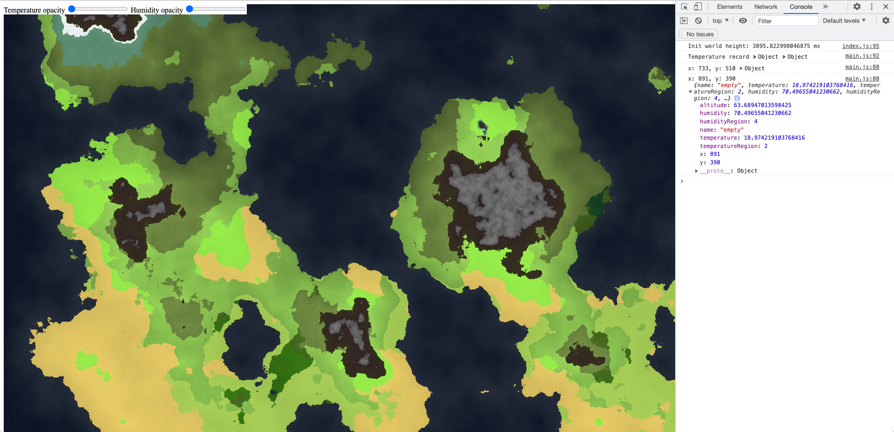

# Map generator
The goal of this project was to create a map generator that could generate a full world where each pixel would have all geographic properties such as humidity level, ground level, temperature and so on. Based on thoses informations we would generate a specific tile type (desert, tropical, forest, ...). The world generator has also an equator where temperature is higher than in north and south poles.

The size a of the map, the sea level, everything can be changed easily. Everything is saved into a big object that could be exported as a json and serve for a data base.

See the result here : 

